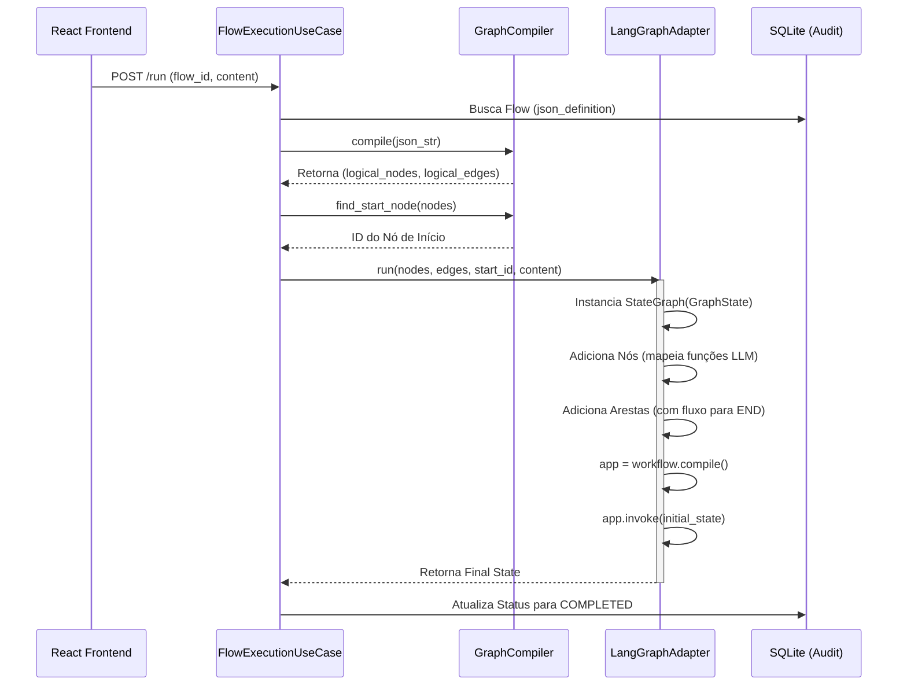

# 🏗️ Compilação e Execução: De JSON para LangGraph

Este documento descreve o processo arquitetural de conversão do fluxo visual (definido como um objeto JSON pelo React Flow) para um motor de execução resiliente baseado em **LangGraph**.

## 1. Visão Geral da Arquitetura

O sistema utiliza o padrão **Port & Adapters (Hexagonal)** para isolar a lógica de orquestração da biblioteca LangGraph.

| Camada | Componente | Responsabilidade |
| :--- | :--- | :--- |
| **Domain** | `GraphCompiler` | Analisar o JSON bruto e extrair nós/arestas lógicos independentes de motor. |
| **Infrastructure** | `LangGraphAdapter` | Traduzir o grafo lógico para uma `StateGraph` do LangGraph e gerenciar a execução. |
| **Application** | `FlowExecutionUseCase` | Orquestrar o ciclo de vida da execução, logging e persistência de resultados. |

---

## 2. Fluxo de Compilação

O processo de compilação transforma as coordenadas visuais e metadados da UI em funções executáveis.



---

## 3. O Ciclo de Vida do Nó LLM

Cada nó definido no JSON é transformado em uma função interna dentro do LangGraph.

1.  **Mapeamento**: O `LangGraphAdapter` itera sobre os nós lógicos.
2.  **Injeção de Dependência**: Para cada nó, uma função `llm_fn` é gerada. Esta função tem acesso ao:
    *   **Provedor/Modelo**: Selecionado no nó.
    *   **Estado Global**: Saídas de todos os nós anteriores.
3.  **Execução**:
    *   O prompt é resolvido (variáveis injetadas).
    *   A IA é chamada.
    *   O resultado JSON é fundido no estado (`operator.ior`).

### Exemplo de Configuração de Nó no LangGraph
```python
# Como o Adapter adiciona um nó
workflow.add_node(node_id, self._make_llm_fn(node_def, log_callback))

# Como o Adapter lida com o fim do grafo
outgoing_sources = {e[0] for e in edges}
for node_def in nodes:
    if node_def["id"] not in outgoing_sources:
        workflow.add_edge(node_def["id"], END)
```

---

## 4. Gerenciamento de Estado (`GraphState`)

O LangGraph utiliza um `TypedDict` para garantir a integridade dos dados durante a execução:

```python
class GraphState(TypedDict):
    content: str               # Texto original do atendimento
    outputs: Annotated[dict, operator.ior] # Dicionário fundido (saídas da IA)
    tracking_id: str           # Referência para auditoria
    current_node: str          # Ponteiro de execução
```

O uso do `operator.ior` (`|`) permite que múltiplos nós escrevam no campo `outputs` sem sobrescrever dados de nós vizinhos, a menos que utilizem a mesma chave.

---

## 5. Rastreabilidade (Observabilidade)

Durante a execução, o `LangGraphAdapter` emite eventos via um `log_callback`. Isso garante que, mesmo se o grafo falhar no meio, os passos anteriores já estarão salvos no banco de dados com:
*   Prompt final (após resolução).
*   Resposta bruta e JSON.
*   **Consumo de Tokens** (Input, Output, Thinking).
